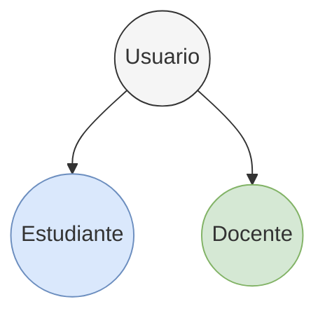

# Casos de Uso - Calculadora de Matrices

Este documento presenta los casos de uso detallados para la Calculadora de Matrices.

## Jerarquía de Actores

* **Usuario**: Cualquier persona que utiliza la calculadora.
* **Estudiante**: Utiliza la calculadora para practicar y aprender álgebra lineal.
* **Docente**: Utiliza la calculadora para mostrar procedimientos y validar ejercicios.

---

## CU-01: Sumar Matrices

**Nombre:** Sumar Matrices  
**Actores:** Usuario (Estudiante/Docente)  
**Descripción:** Permite sumar dos matrices de hasta 4x4, mostrando el resultado y los pasos intermedios.

**Precondiciones:**
- Ambas matrices tienen las mismas dimensiones (n x m, n,m ≤ 4).
- Todos los valores son números reales.

**Flujo Principal:**
1. El usuario ingresa ambas matrices.
2. El sistema valida dimensiones y datos.
3. El usuario selecciona la operación "Suma".
4. El sistema realiza la suma elemento a elemento.
5. El sistema muestra el resultado y los pasos intermedios.

**Flujos Alternativos:**
- Si las dimensiones no coinciden, se muestra un mensaje de error.
- Si hay valores no numéricos, se muestra un mensaje de error.

**Postcondiciones:**
- Se muestra la matriz resultado y el detalle de la suma por elemento.

**Excepciones:**
- Dimensiones incompatibles.
- Datos no numéricos.

**Frecuencia de uso:** Frecuente.

---

## CU-02: Restar Matrices

**Nombre:** Restar Matrices  
**Actores:** Usuario (Estudiante/Docente)  
**Descripción:** Permite restar dos matrices de hasta 4x4, mostrando el resultado y los pasos intermedios.

**Precondiciones:**
- Ambas matrices tienen las mismas dimensiones.
- Todos los valores son números reales.

**Flujo Principal:**
1. El usuario ingresa ambas matrices.
2. El sistema valida dimensiones y datos.
3. El usuario selecciona la operación "Resta".
4. El sistema realiza la resta elemento a elemento.
5. El sistema muestra el resultado y los pasos intermedios.

**Flujos Alternativos:**
- Si las dimensiones no coinciden, se muestra un mensaje de error.
- Si hay valores no numéricos, se muestra un mensaje de error.

**Postcondiciones:**
- Se muestra la matriz resultado y el detalle de la resta por elemento.

**Excepciones:**
- Dimensiones incompatibles.
- Datos no numéricos.

**Frecuencia de uso:** Frecuente.

---

## CU-03: Multiplicar Matrices

**Nombre:** Multiplicar Matrices  
**Actores:** Usuario (Estudiante/Docente)  
**Descripción:** Permite multiplicar dos matrices compatibles (hasta 4x4), mostrando el resultado y los pasos intermedios (producto fila por columna).

**Precondiciones:**
- El número de columnas de la primera matriz es igual al número de filas de la segunda.
- Todos los valores son números reales.

**Flujo Principal:**
1. El usuario ingresa ambas matrices.
2. El sistema valida dimensiones y datos.
3. El usuario selecciona la operación "Multiplicación".
4. El sistema realiza la multiplicación fila por columna.
5. El sistema muestra el resultado y los pasos intermedios.

**Flujos Alternativos:**
- Si las dimensiones no son compatibles, se muestra un mensaje de error.
- Si hay valores no numéricos, se muestra un mensaje de error.

**Postcondiciones:**
- Se muestra la matriz resultado y el detalle del cálculo de cada elemento.

**Excepciones:**
- Dimensiones incompatibles.
- Datos no numéricos.

**Frecuencia de uso:** Frecuente.

---

## CU-04: Calcular Determinante

**Nombre:** Calcular Determinante  
**Actores:** Usuario (Estudiante/Docente)  
**Descripción:** Permite calcular el determinante de una matriz cuadrada (hasta 4x4), mostrando el procedimiento paso a paso.

**Precondiciones:**
- La matriz es cuadrada.
- Todos los valores son números reales.

**Flujo Principal:**
1. El usuario ingresa la matriz.
2. El sistema valida que sea cuadrada y los datos.
3. El usuario selecciona "Determinante".
4. El sistema calcula el determinante mostrando los pasos (expansión por cofactores, reducción, etc.).
5. El sistema muestra el resultado y los pasos intermedios.

**Flujos Alternativos:**
- Si la matriz no es cuadrada, se muestra un mensaje de error.
- Si hay valores no numéricos, se muestra un mensaje de error.

**Postcondiciones:**
- Se muestra el valor del determinante y el procedimiento seguido.

**Excepciones:**
- Matriz no cuadrada.
- Datos no numéricos.

**Frecuencia de uso:** Frecuente.

---

## CU-05: Calcular Inversa

**Nombre:** Calcular Inversa  
**Actores:** Usuario (Estudiante/Docente)  
**Descripción:** Permite calcular la inversa de una matriz cuadrada (hasta 4x4), mostrando el procedimiento paso a paso.

**Precondiciones:**
- La matriz es cuadrada y no singular.
- Todos los valores son números reales.

**Flujo Principal:**
1. El usuario ingresa la matriz.
2. El sistema valida que sea cuadrada y no singular.
3. El usuario selecciona "Inversa".
4. El sistema calcula la inversa mostrando los pasos (matriz aumentada, operaciones elementales, etc.).
5. El sistema muestra el resultado y los pasos intermedios.

**Flujos Alternativos:**
- Si la matriz es singular (determinante cero), se muestra un mensaje de error.
- Si hay valores no numéricos, se muestra un mensaje de error.

**Postcondiciones:**
- Se muestra la matriz inversa y el procedimiento seguido.

**Excepciones:**
- Matriz singular.
- Matriz no cuadrada.
- Datos no numéricos.

**Frecuencia de uso:** Ocasional.

---

## CU-06: Resolver Sistema de Ecuaciones (Gauss, Gauss-Jordan, LU)

**Nombre:** Resolver Sistema de Ecuaciones Lineales  
**Actores:** Usuario (Estudiante/Docente)  
**Descripción:** Permite resolver sistemas de ecuaciones lineales (hasta 4x4) usando los métodos de Eliminación Gaussiana, Gauss-Jordan o Factorización LU, mostrando el procedimiento paso a paso.

**Precondiciones:**
- El sistema tiene n ecuaciones con n incógnitas (n ≤ 4).
- Todos los valores son números reales.

**Flujo Principal:**
1. El usuario ingresa la matriz de coeficientes y el vector de términos independientes.
2. El sistema valida dimensiones y datos.
3. El usuario selecciona el método de resolución.
4. El sistema ejecuta el método seleccionado, mostrando cada paso (operaciones elementales, matrices intermedias, sustituciones).
5. El sistema muestra la solución y el procedimiento completo.

**Flujos Alternativos:**
- Si el sistema es incompatible o tiene infinitas soluciones, se muestra un mensaje de advertencia.
- Si hay valores no numéricos, se muestra un mensaje de error.

**Postcondiciones:**
- Se muestra la solución del sistema y el detalle del procedimiento.

**Excepciones:**
- Sistema incompatible o indeterminado.
- Datos no numéricos.

**Frecuencia de uso:** Frecuente en contextos educativos.

---

## CU-07: Visualizar Pasos Intermedios

**Nombre:** Visualizar Pasos Intermedios  
**Actores:** Usuario (Estudiante/Docente)  
**Descripción:** Permite al usuario ver el desarrollo paso a paso de cualquier operación realizada.

**Precondiciones:**
- Se ha realizado una operación matricial.

**Flujo Principal:**
1. El usuario solicita ver los pasos intermedios.
2. El sistema muestra la lista de pasos y matrices intermedias.

**Postcondiciones:**
- El usuario comprende el procedimiento seguido.

**Frecuencia de uso:** Muy frecuente en docencia.

---

## CU-08: Validar Entradas

**Nombre:** Validar Entradas  
**Actores:** Usuario (Estudiante/Docente)  
**Descripción:** El sistema valida automáticamente las dimensiones y los datos ingresados antes de ejecutar cualquier operación.

**Precondiciones:**
- El usuario ha ingresado datos en los formularios.

**Flujo Principal:**
1. El sistema verifica que las dimensiones sean correctas.
2. El sistema verifica que todos los datos sean números reales.
3. Si hay errores, muestra mensajes claros y orientados al usuario.

**Postcondiciones:**
- Solo se permite ejecutar operaciones con datos válidos.

**Frecuencia de uso:** Siempre.

---

## CU-09: Manejar Errores

**Nombre:** Manejar Errores  
**Actores:** Usuario (Estudiante/Docente)  
**Descripción:** El sistema detecta y reporta errores numéricos o de entrada, mostrando mensajes claros en español.

**Precondiciones:**
- El usuario intenta ejecutar una operación.

**Flujo Principal:**
1. El sistema detecta errores de dimensiones, tipo de datos, singularidad, etc.
2. El sistema muestra mensajes de error detallados y orientados al usuario.

**Postcondiciones:**
- El usuario comprende el motivo del error y puede corregirlo.

**Frecuencia de uso:** Ocasional.

---

## CU-10: Consultar Teoría y Ejemplos

**Nombre:** Consultar Teoría y Ejemplos  
**Actores:** Usuario (Estudiante/Docente)  
**Descripción:** Permite consultar la teoría y ejemplos de los métodos algebraicos implementados.

**Precondiciones:**
- El usuario accede a la sección de ayuda o documentación.

**Flujo Principal:**
1. El usuario selecciona el método o operación de interés.
2. El sistema muestra la teoría y ejemplos numéricos.

**Postcondiciones:**
- El usuario comprende el fundamento teórico y el procedimiento.

**Frecuencia de uso:** Frecuente en contextos educativos.

---

## CU-11: Guardar y Consultar Historial (Opcional)

**Nombre:** Guardar y Consultar Historial  
**Actores:** Usuario (Estudiante/Docente)  
**Descripción:** Permite guardar el historial de operaciones y consultar resultados anteriores.

**Precondiciones:**
- El usuario ha realizado operaciones previas.

**Flujo Principal:**
1. El usuario solicita guardar o consultar el historial.
2. El sistema almacena o recupera las operaciones y resultados.

**Postcondiciones:**
- El usuario puede revisar operaciones pasadas.

**Frecuencia de uso:** Opcional.

---

Este documento debe complementarse con diagramas de casos de uso y diagramas de secuencia para cada operación principal.
