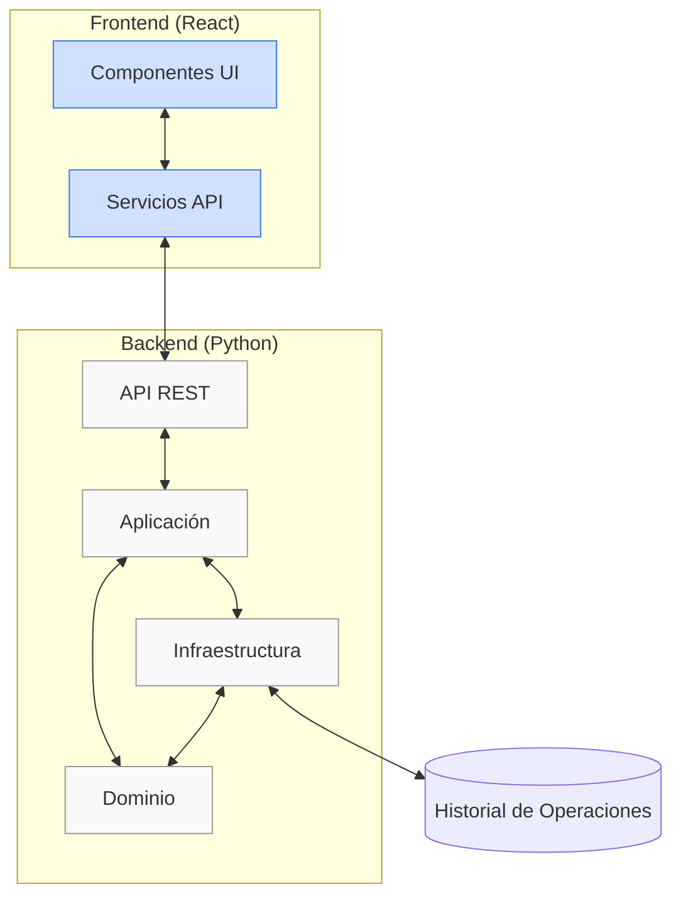
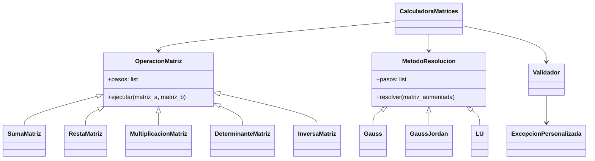
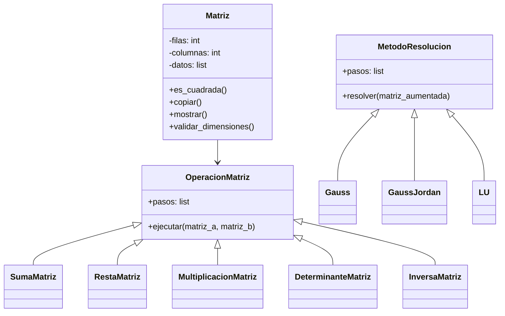
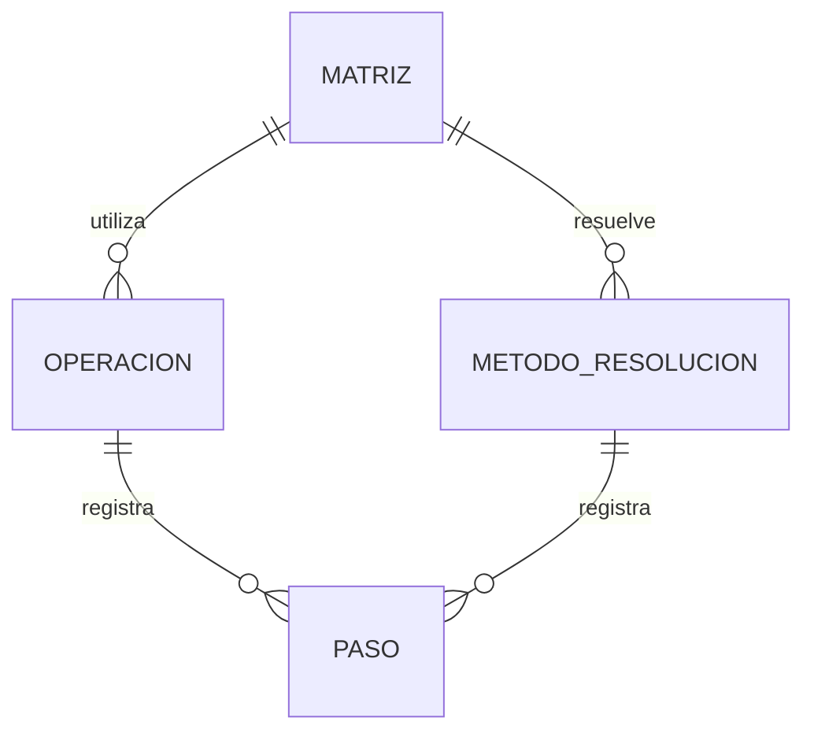
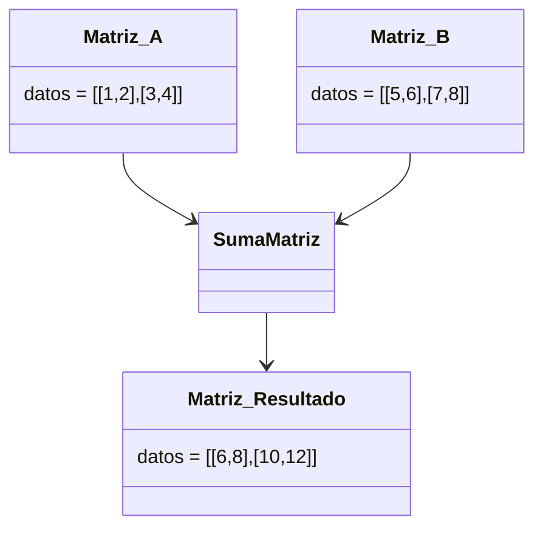
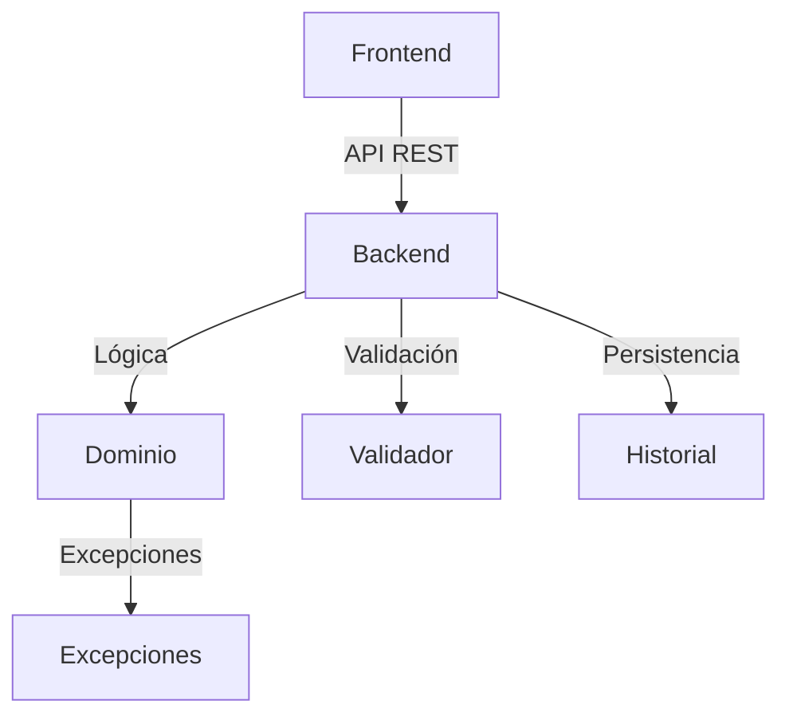

# Diagramas UML y de Arquitectura - Calculadora de Matrices

Este documento presenta los diagramas UML y de arquitectura para la Calculadora de Matrices.

## Índice
1. [Diagrama de Arquitectura](#diagrama-de-arquitectura)
2. [Diagrama de Patrones de Diseño](#diagrama-de-patrones-de-diseño)
3. [Diagrama de Clases](#diagrama-de-clases)
4. [Modelo Entidad-Relación](#modelo-entidad-relación)
5. [Diagrama de Objetos](#diagrama-de-objetos)
6. [Diagrama de Componentes](#diagrama-de-componentes)

---

## Diagrama de Arquitectura

---

## Diagrama de Patrones de Diseño

---

## Diagrama de Clases

---

## Modelo Entidad-Relación (MER)

---

## Diagrama de Objetos

---

## Diagrama de Componentes

---

Estos diagramas deben complementarse con los diagramas de secuencia y casos de uso para una documentación completa.
