# Diagramas de Secuencia - Calculadora de Matrices

Este documento presenta los diagramas de secuencia para todos los casos de uso principales y extendidos de la Calculadora de Matrices.

---

## CU-01: Sumar Matrices

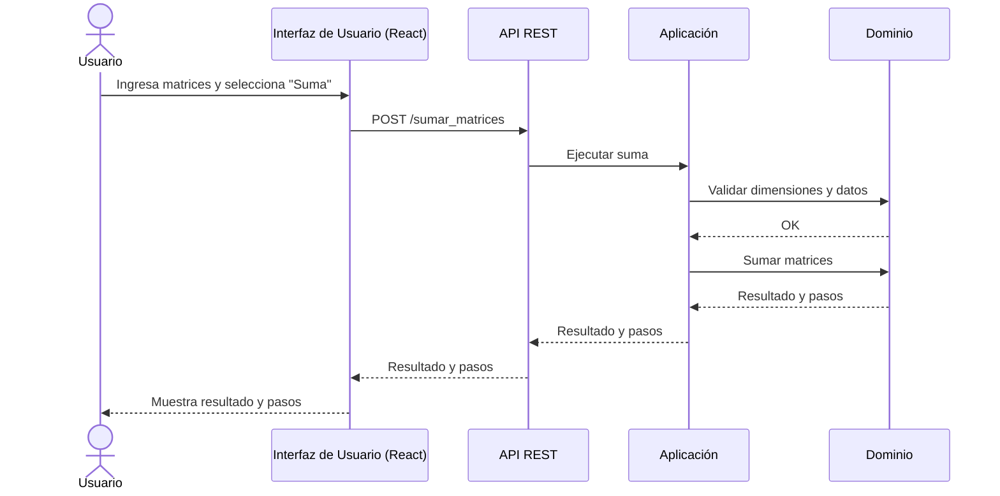

---

## CU-02: Restar Matrices

---

## CU-03: Multiplicar Matrices

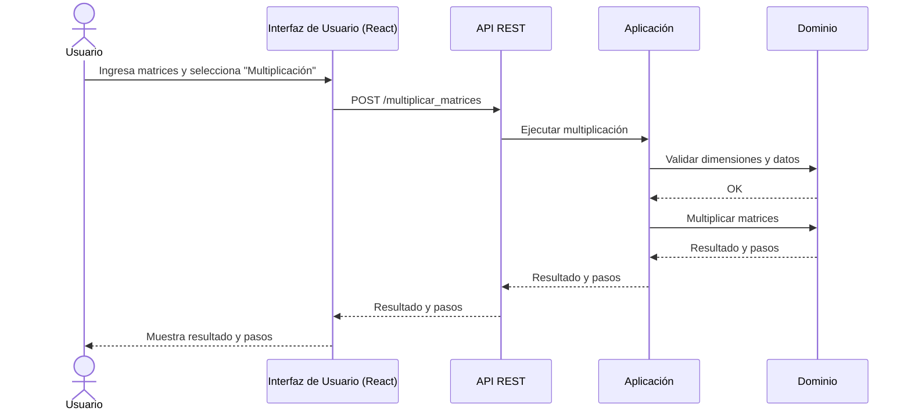

---

## CU-04: Calcular Determinante

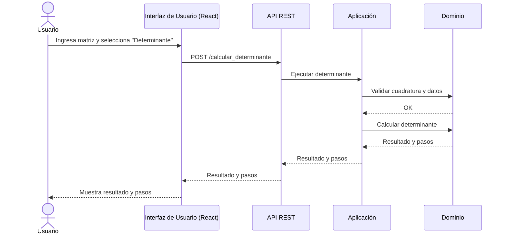

---

## CU-05: Calcular Inversa

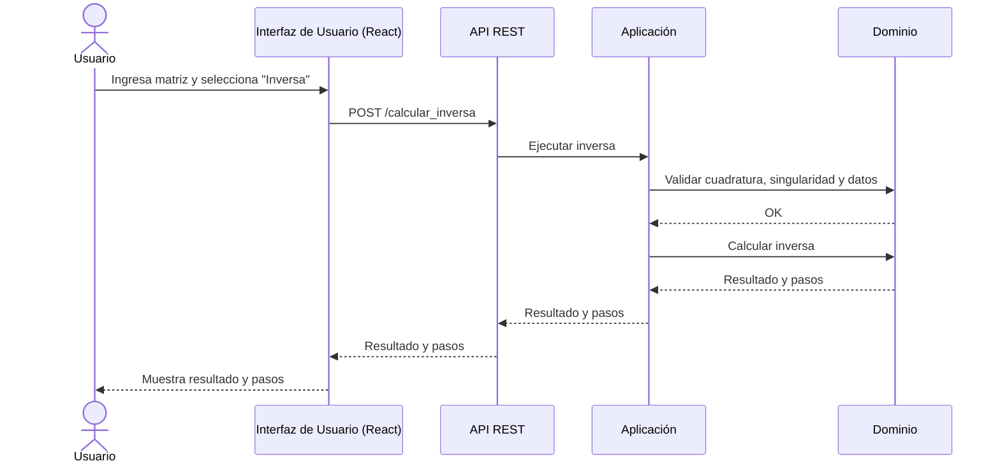

---

## CU-06: Resolver Sistema de Ecuaciones

### CU-06a: Eliminación Gaussiana

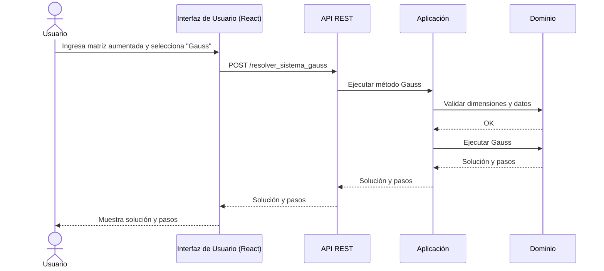

---

### CU-06b: Gauss-Jordan

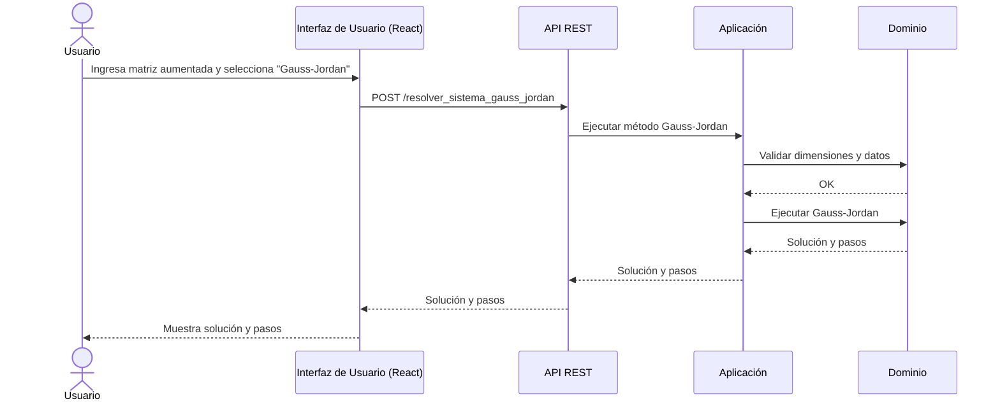

---

### CU-06c: Factorización LU

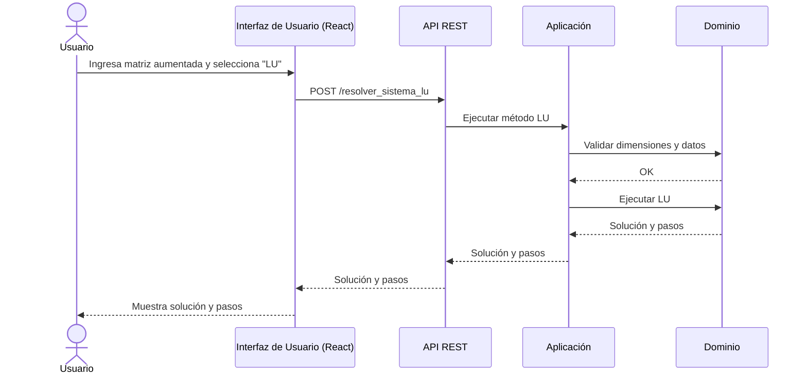

---

## CU-07: Visualizar Pasos Intermedios

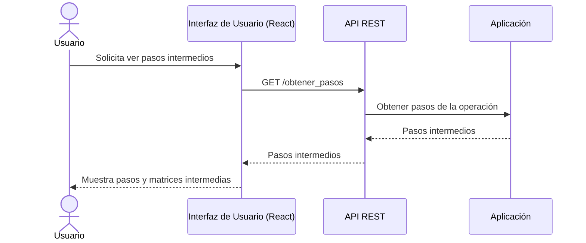

---

## CU-08: Validar Entradas

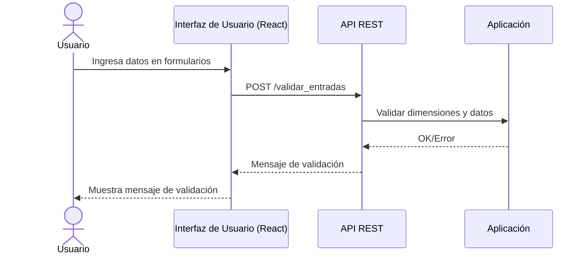

---

## CU-09: Manejar Errores

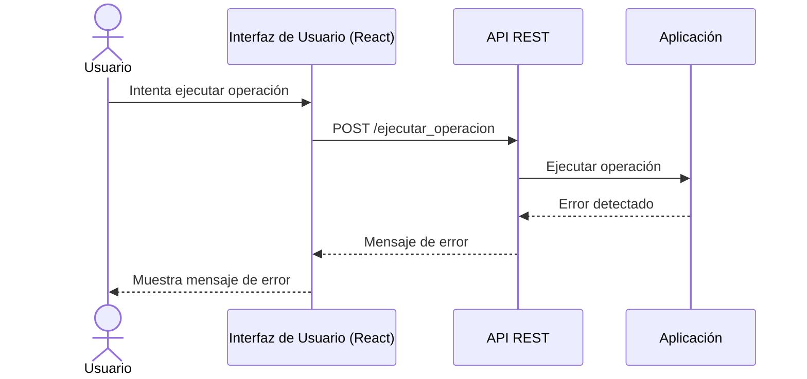

---

## CU-10: Consultar Teoría y Ejemplos

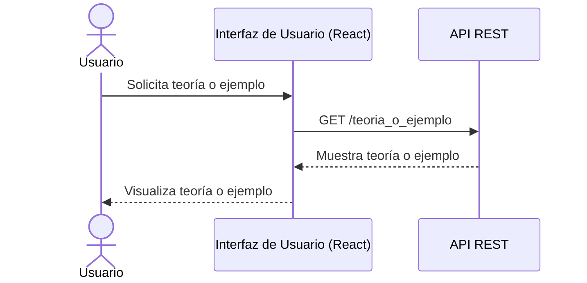

---

## CU-11: Guardar y Consultar Historial (Opcional)

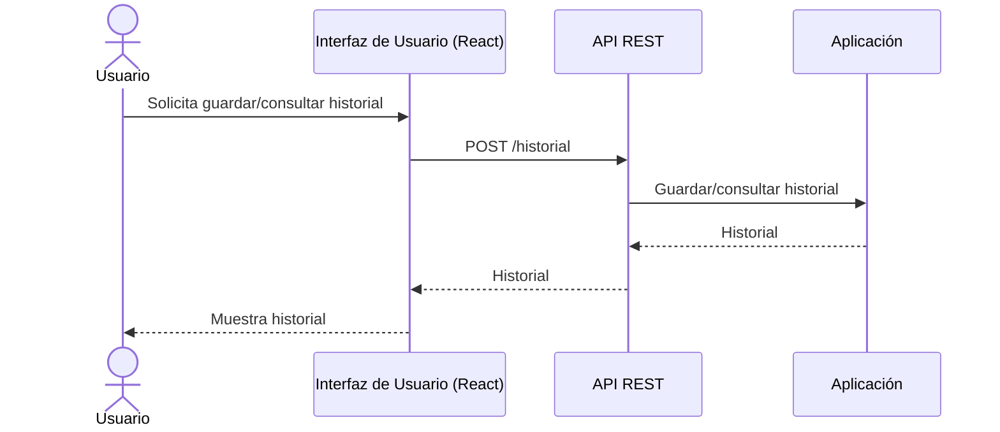

---

Estos diagramas deben complementarse con los diagramas de clases y arquitectura para una documentación completa.
